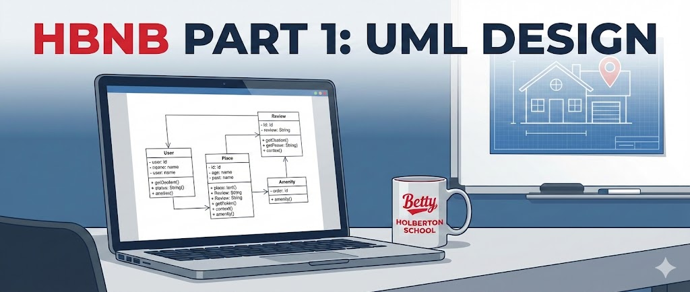

# HBnB Evolution – Part 1: Technical Documentation

<p align="center">
  
</p>

---

## Project Overview

HBnB Evolution is a simplified AirBnB-like application designed to demonstrate best practices in software architecture and object-oriented design.

The purpose of **Part 1** of this project is to create comprehensive technical documentation that defines the architecture, core business logic, and interactions within the system. This documentation serves as a blueprint for the implementation phases that follow.

---

## Objectives

The main objectives of this part are:

- Understand and apply a layered architecture
- Design the core business entities of the application
- Represent system interactions using UML diagrams
- Provide clear documentation to guide future development

---

## Application Architecture

The HBnB Evolution application follows a **three-layered architecture**, ensuring a clear separation of concerns:

### 1. Presentation Layer
- Handles user interactions
- Exposes APIs and services
- Does not contain business logic

### 2. Business Logic Layer
- Contains the core business rules
- Defines the main domain models:
  - User
  - Admin (inherits User)
  - Place
  - Review
  - Amenity

### 3. Persistence Layer
- Manages data storage and retrieval
- Interacts directly with the database

---

## Facade Pattern

To simplify communication between layers, the application uses the **Facade design pattern**:

- Provides a unified interface between Presentation and Business Logic layers
- Hides internal complexity
- Reduces coupling between components
- Centralizes business operations

---

## UML Diagrams

This part of the project includes the following UML diagrams:

### High-Level Package Diagram
- Illustrates the three-layer architecture
- Shows communication between layers via the Facade pattern

### Class Diagram (Business Logic Layer)
- Represents the core entities and their relationships
- Includes attributes, methods, and associations

### Sequence Diagrams
- Demonstrate interactions between layers for key API calls:
  - User registration
  - Place creation
  - Review submission
  - Fetching a list of places

---

## Project Structure
````
part1/
├── README.md
├── task_0/
│ ├── high_level_package_diagram.mmd
│ ├── high_level_package_diagram.png
│ └── High-Level_Package_Diagram.md
├── task_1/
│ ├── class_diagram_for_BLL.mmd
│ ├── Class_diagram_for_Business_logic_Layer.png
│ └── Detailed-class_diagram_for_business_logic_layer.md
├── task_2/
│ ├── Sequence_diagrams_for_API_Calls.mmd
│ ├── Sequence-Diagrams_for_API_Calls.md
│ ├── User_Registration_API_CALL_diagram.png
│ ├── Place_Creation_API_CALL_diagram.png
│ ├── Review_Submission_API_CALL_diagram.png
│ └── Fetch_Places_API_CALL_diagram.png
├── task_3/
│ ├── Technical_Documentation_part1.md
│ └── HBnB_Technical_Documentation.pdf
└── assets/
└── hbnb_banner.png
````

---

## Tools and Resources

- UML notation
- Mermaid.js for diagrams
- draw.io (optional)
- Object-Oriented Programming principles
- Markdown and VS Code for documentation

---

## Expected Outcome

By the end of this part, the project provides clear and structured technical documentation that:

- Describes the system architecture
- Defines the business logic
- Explains interactions between components
- Prepares the ground for implementation in future parts

---

## Authors

- **Sara Rebati**
- **Valentin Planchon**
- **Damien Rossi**

**HBnB Evolution Project – Part 1**
Holberton School