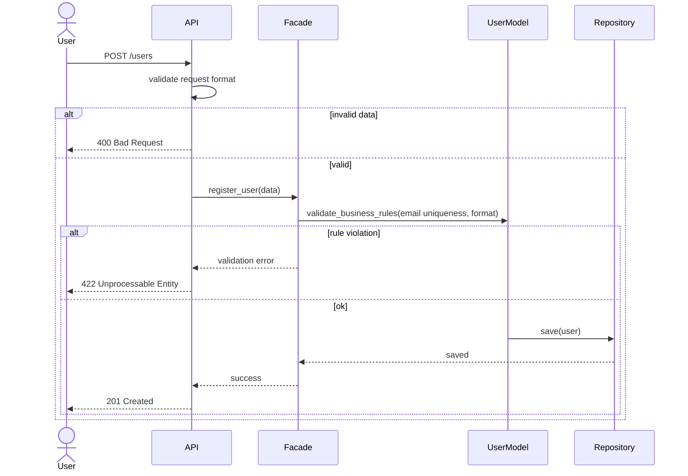
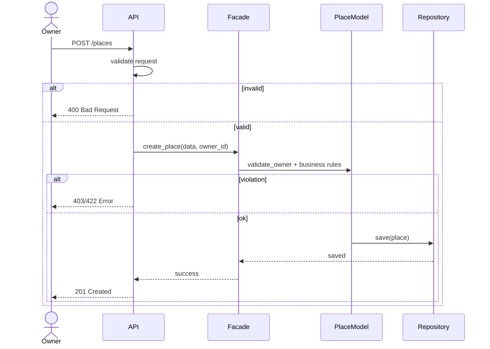

# Sequence Diagrams – HBnB Application

## Overview

This document presents sequence diagrams illustrating how the different layers of the HBnB application interact to handle key API calls. These diagrams show the flow of information between the Presentation Layer, the Business Logic Layer, and the Persistence Layer.

---

## User Registration

This sequence diagram illustrates the process of creating a new user account. The request flows from the API to the Business Logic layer through the Facade, where validation and user creation are performed before persisting the data.

## Diagramme 1 : User Registration

---
## Place creation : owner
This diagram represents the creation of a place by an Owner. The system validates ownership and business rules before saving the place in the database.


---
## Diagramme 3 : Review Submission (Visitor)

This diagram shows how a Visitor submits a review for a place. The review is validated and stored while respecting the layered architecture.


```mermaid
sequenceDiagram
    actor Visitor
    participant API
    participant Facade
    participant ReviewModel
    participant Repository

    Visitor ->> API: POST /reviews

    API ->> API: validate request

    alt invalid
        API -->> Visitor: 400 Bad Request
    else valid
        API ->> Facade: create_review(data)
        Facade ->> ReviewModel: validate rules (rating, existence, uniqueness)

        alt violation
            API -->> Visitor: 422/409 Error
        else ok
            ReviewModel ->> Repository: save(review)
            Repository -->> Facade: saved
            Facade -->> API: success
            API -->> Visitor: 201 Created
        end
    end
````
---
## Diagramm : Fetching a List of Places

This diagram illustrates how users retrieve a list of places. The request is processed through the Business Logic layer before querying the database and returning the results.

```mermaid
sequenceDiagram
    actor User
    participant API
    participant Facade
    participant PlaceModel
    participant Repository

    User ->> API: GET /places

    API ->> API: validate filters

    alt invalid filters
        API -->> User: 400 Bad Request
    else valid
        API ->> Facade: get_places(filters)
        Facade ->> Repository: query_places(filters)
        Repository -->> Facade: places
        Facade -->> API: response
        API -->> User: 200 OK
    end
```
---
