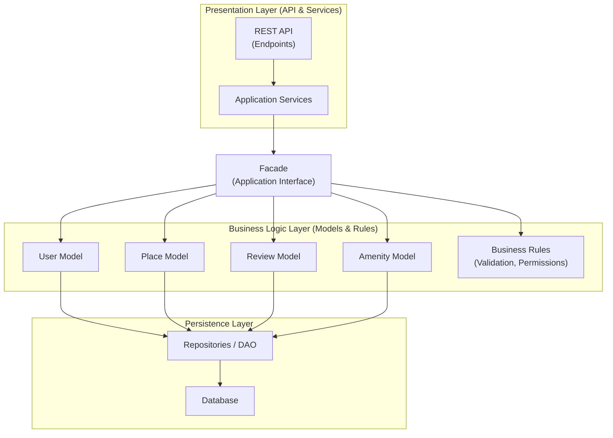

# High-Level Package Diagram — HBnB Evolution

## Objective

The objective of this document is to present a high-level overview of the architecture of the HBnB Evolution application.
It illustrates how the application is organized into three main layers and how these layers communicate with each other using the Facade design pattern.

<<<<<<< HEAD
---
=======
This document also explains the structural decisions behind the architecture and clarifies the communication flow between components.

>>>>>>> d4236ee3873b598a28b02929212898764f239ffe

## Application Architecture Overview

The HBnB Evolution application follows a layered architecture composed of three main layers:

- Presentation Layer
- Business Logic Layer
- Persistence Layer

Each layer has a specific responsibility and communicates only with the appropriate adjacent layer.

<<<<<<< HEAD
---
=======

## What is a Layered Architecture?

A layered architecture is a software design pattern that separates concerns by organizing code into logical layers.
Each layer handles a specific responsibility and reduces dependencies between components.

This structure improves:

* Maintainability

* Scalability

* Readability

* Testability

>>>>>>> d4236ee3873b598a28b02929212898764f239ffe

## Presentation Layer

The Presentation Layer is responsible for handling interactions between the user and the application.
It contains the APIs and services exposed to clients.

This layer does not contain any business logic.
All requests are delegated to the Business Logic Layer through the Facade.

<<<<<<< HEAD
---
=======
- Responsibilities:

* Receiving HTTP requests

* Validating input structure

* Formatting responses

* Handling status codes

* Delegating operations to the Facade

- Components:

* REST API

* Application Services

The REST API defines endpoints such as:

* POST /users

* GET /places

* POST /reviews

Application Services prepare the request and forward it to the Facade.

>>>>>>> d4236ee3873b598a28b02929212898764f239ffe

## Business Logic Layer

The Business Logic Layer represents the core of the application.
It contains the business rules and the main domain models such as User, Place, Review, and Amenity.

This layer is responsible for validating data and applying business logic before interacting with the Persistence Layer.

<<<<<<< HEAD
---
=======
- Responsibilities :

* Enforcing business rules

* Validating domain constraints

* Managing application behavior

* Coordinating domain operations

- Domain Models:

* User

* Place

* Review

* Amenity

- Example of business rules:

* A user must exist before submitting a review

* Only the owner of a place can modify it

* Required attributes must be validated

>>>>>>> d4236ee3873b598a28b02929212898764f239ffe

## Persistence Layer

The Persistence Layer is responsible for data storage and retrieval.
It manages interactions with the database and provides mechanisms to create, read, update, and delete data.

This layer is isolated from the Presentation Layer.

<<<<<<< HEAD
---
=======
- Responsibilities :

* Saving entities

* Retrieving entities

* Updating records

* Deleting records

- Components :

* Repositories

* Database

Repositories act as intermediaries between the Business Logic Layer and the database.

This abstraction ensures that business logic is not directly coupled to database implementation.

>>>>>>> d4236ee3873b598a28b02929212898764f239ffe

## Facade Pattern

The communication between the Presentation Layer and the Business Logic Layer is handled through the Facade design pattern.

<<<<<<< HEAD
The Facade provides a unified interface that simplifies interactions and hides the internal complexity of the business logic.
This approach reduces coupling between layers and improves maintainability and scalability.

=======
- What is the Facade Pattern?

The Facade provides a unified interface that simplifies interactions and hides the internal complexity of the business logic.
This approach reduces coupling between layers and improves maintainability and scalability.

- Benefits:

* Reduces coupling between layers

* Simplifies communication

* Improves maintainability

* Enhances scalability

* Provides a single entry point to business logic

The Presentation Layer communicates only with the Facade, never directly with domain models.
>>>>>>> d4236ee3873b598a28b02929212898764f239ffe
---

## High-Level Package Diagram

The following diagram illustrates the overall architecture of the HBnB Evolution application and the communication pathways between layers.

---

<<<<<<< HEAD
## High-Level Package Diagram (Version 1)

---
## High-Level Package Diagram (Version 2)
=======
## High-Level Package Diagram
>>>>>>> d4236ee3873b598a28b02929212898764f239ffe

<<<<<<< HEAD

---
=======
---
## Diagram Explanation

Diagram Orientation
---
The diagram is structured using a Top-to-Bottom (TB) flow.

This means that the logical execution flow starts from the top (Presentation Layer) and moves downward toward the Persistence Layer.

The downward direction represents the execution of the request, while the response travels back upward through the same layers.

- Meaning of the Arrows :

* Arrows in the diagram represent:

* Method calls

* Communication flow

* Dependency direction

* Responsibility delegation

An arrow from component A → B means:

* A calls B

* A depends on B

* Control is transferred from A to B

The direction of the arrow is important because it shows which component initiates the interaction.

## Communication Flow Breakdown:

#API → Services

The REST API receives the HTTP request from the client.

It forwards the request to the Application Services for preprocessing and initial handling.

#Services → Facade

The Application Services delegate operations to the Facade.

They do not directly interact with domain models.

This ensures proper separation of concerns and prevents tight coupling between layers.

#Facade → Domain Models

The Facade coordinates interactions with domain models:

* User

* Place

* Review

* Amenity

Depending on the requested operation, the Facade calls the appropriate model.

The Facade acts as a centralized access point to business logic.

#Domain Models → Repository

Domain models delegate data persistence operations to the Repository layer.

This ensures:

* Database abstraction

* Clean architecture

* Reduced coupling

The business logic does not directly communicate with the database.

#Repository → Database

The Repository interacts directly with the Database.

It is responsible for:

* Translating domain objects into database records

* Executing queries

* Managing persistence operations

The database represents the lowest layer of the architecture.

Example of a Typical Request Flow :
---
Example: Creating a Place

1- The client sends an HTTP request.

2- The REST API receives the request.

3- The API forwards it to Application Services.

4- The Services call the Facade.

5- The Facade delegates to the Place model.

6- The Place model validates business rules.

7- The Place model calls the Repository.

8- The Repository writes to the Database.

9- A response is returned upward through the same path.

The flow always goes downward for execution and upward for the response.
---
##Architectural Benefits

* This layered design provides:

* Clear separation of responsibilities

* Low coupling between components

* High cohesion within layers

* Improved scalability

* Better maintainability

* Easier unit testing

* Cleaner code organization
>>>>>>> d4236ee3873b598a28b02929212898764f239ffe
