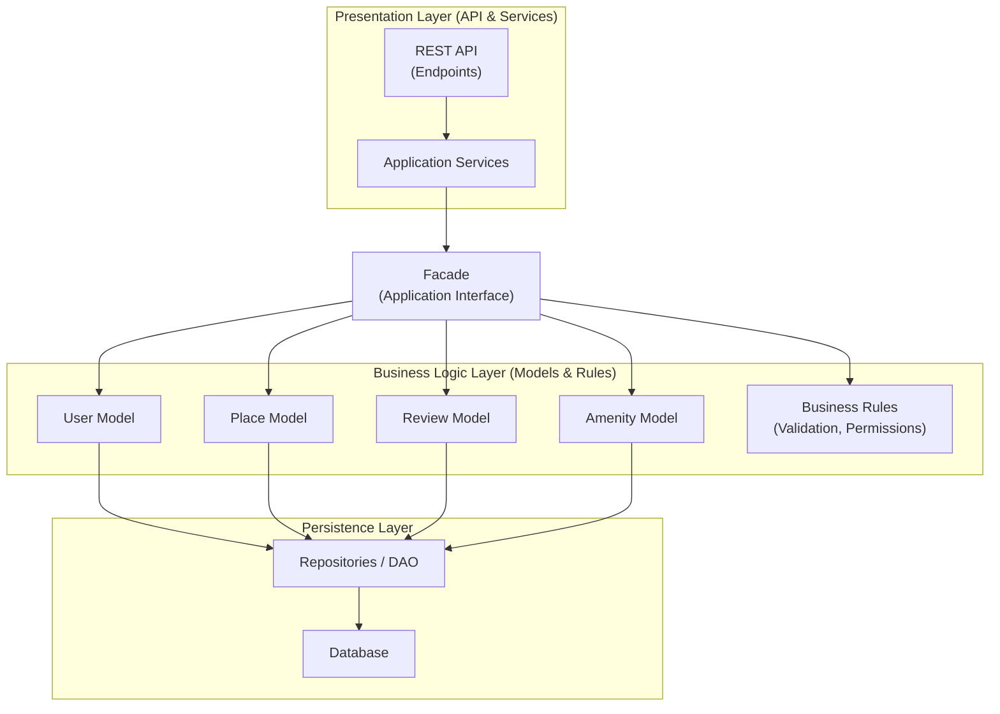

# High-Level Package Diagram — HBnB Evolution

## Objective

The objective of this document is to present a high-level overview of the architecture of the HBnB Evolution application.
It illustrates how the application is organized into three main layers and how these layers communicate with each other using the Facade design pattern.

---

## Application Architecture Overview

The HBnB Evolution application follows a layered architecture composed of three main layers:

- Presentation Layer
- Business Logic Layer
- Persistence Layer

Each layer has a specific responsibility and communicates only with the appropriate adjacent layer.

---

## Presentation Layer

The Presentation Layer is responsible for handling interactions between the user and the application.
It contains the APIs and services exposed to clients.

This layer does not contain any business logic.
All requests are delegated to the Business Logic Layer through the Facade.

---

## Business Logic Layer

The Business Logic Layer represents the core of the application.
It contains the business rules and the main domain models such as User, Place, Review, and Amenity.

This layer is responsible for validating data and applying business logic before interacting with the Persistence Layer.

---

## Persistence Layer

The Persistence Layer is responsible for data storage and retrieval.
It manages interactions with the database and provides mechanisms to create, read, update, and delete data.

This layer is isolated from the Presentation Layer.

---

## Facade Pattern

The communication between the Presentation Layer and the Business Logic Layer is handled through the Facade design pattern.

The Facade provides a unified interface that simplifies interactions and hides the internal complexity of the business logic.
This approach reduces coupling between layers and improves maintainability and scalability.

---

## High-Level Package Diagram

The following diagram illustrates the overall architecture of the HBnB Evolution application and the communication pathways between layers.

---

## High-Level Package Diagram (Version 1)

---
## High-Level Package Diagram (Version 2)

---
