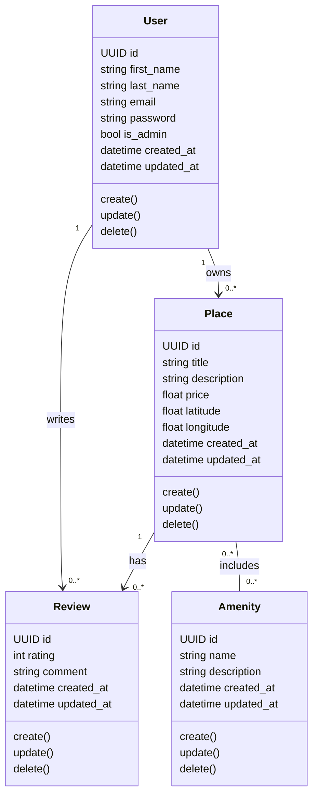
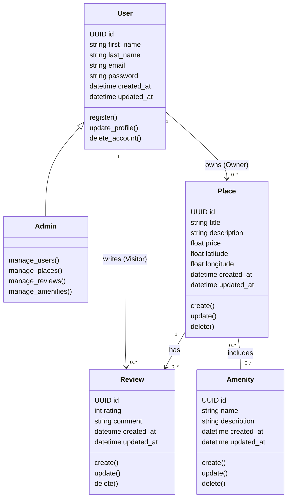

---
## Detailed Class Diagram – Business Logic Layer

The Business Logic layer contains the core entities of the HBnB application: User, Place, Review, and Amenity. These classes represent the main business concepts and enforce the application’s business rules.

Each entity includes a unique identifier (UUID) as well as creation and update timestamps to ensure traceability and auditability.

A User can own multiple Places and write multiple Reviews. A Place belongs to a single User, can have multiple Reviews, and can include multiple Amenities. Reviews are associated with both a User and a Place, representing feedback left by users on places they have visited.

The Amenity entity represents facilities that can be associated with multiple places, resulting in a many-to-many relationship.

This diagram provides a clear and structured representation of the core business logic and serves as a foundation for the implementation phase.
---
---
## Datailled class Diagram for business logic layer (version 1)
---

---
## Datailled class Diagram for business logic layer (version 2)
---

---
### Explication of this version
---
## Detailed Class Diagram – Business Logic Layer (version 2)
---

The Business Logic layer is centered around the User entity, which represents all users of the HBnB application. Different roles are derived from the User entity based on behavior and permissions.

An Admin is a specialized type of User with elevated privileges, represented through inheritance. Admin users can manage users, places, reviews, and amenities across the system.

A User can act as an Owner if they own one or more Places. This role is represented through the association between User and Place. Owners are responsible for creating, updating, and deleting their own places.

A User can also act as a Visitor if they do not own places but interact with the platform by browsing places and writing reviews. This role is represented by the association between User and Review.

Places are owned by a single User and can have multiple Reviews. Amenities can be associated with multiple Places, resulting in a many-to-many relationship.

This design clearly separates responsibilities while keeping the model simple and extensible.

---
