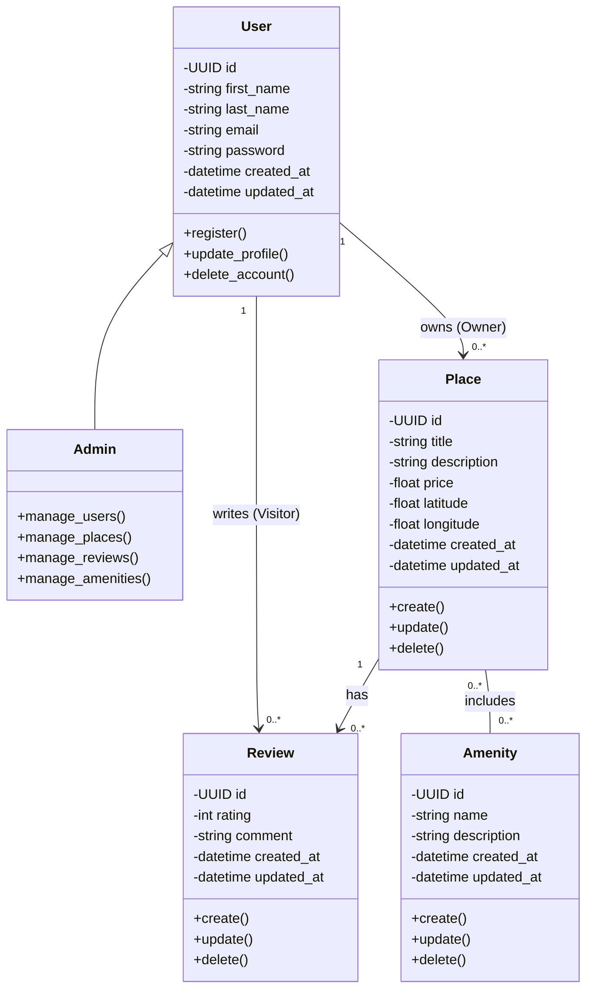

# Diagramme de Classes Détaillé - Couche Logique Métier

## Introduction

Ce diagramme représente l'architecture détaillée de la couche logique métier (Business Logic Layer) de l'application HBnB. Il illustre les entités principales du système, leurs attributs, leurs méthodes et les relations qui les lient.

## Diagramme de Classes

## Résumé Explicatif

### Classes Principales

#### 1. User (Utilisateur)
La classe `User` représente l'utilisateur de base du système. Elle contient :
- **Attributs** : identifiant unique (UUID), informations personnelles (prénom, nom, email), mot de passe chiffré, et horodatages de création/modification
- **Méthodes** : inscription (`register()`), mise à jour du profil (`update_profile()`), et suppression du compte (`delete_account()`)

#### 2. Admin (Administrateur)
La classe `Admin` hérite de `User` et ajoute des privilèges administratifs :
- **Relation** : Spécialisation de `User` (héritage)
- **Méthodes** : gestion des utilisateurs, des lieux, des avis et des équipements du système

#### 3. Place (Lieu)
La classe `Place` représente un logement/propriété disponible à la location :
- **Attributs** : identifiant unique, titre, description, prix, coordonnées géographiques (latitude/longitude), et horodatages
- **Méthodes** : opérations CRUD (création, mise à jour, suppression)

#### 4. Review (Avis)
La classe `Review` représente les avis laissés par les visiteurs :
- **Attributs** : identifiant unique, note (rating), commentaire, et horodatages
- **Méthodes** : opérations CRUD (création, mise à jour, suppression)

#### 5. Amenity (Équipement)
La classe `Amenity` représente les équipements/services disponibles :
- **Attributs** : identifiant unique, nom, description, et horodatages
- **Méthodes** : opérations CRUD (création, mise à jour, suppression)

### Relations entre Classes

#### Relation User-Place (Propriétaire)
- **Cardinalité** : `1 User` → `0..*` Places
- **Rôle** : Un utilisateur peut posséder (owns) zéro ou plusieurs lieux en tant que **propriétaire (Owner)**

#### Relation User-Review (Visiteur)
- **Cardinalité** : `1 User` → `0..*` Reviews
- **Rôle** : Un utilisateur peut écrire (writes) zéro ou plusieurs avis en tant que **visiteur (Visitor)**

#### Relation Place-Review
- **Cardinalité** : `1 Place` → `0..*` Reviews
- **Signification** : Un lieu peut avoir (has) zéro ou plusieurs avis

#### Relation Place-Amenity
- **Cardinalité** : `0..*` Places ↔ `0..*` Amenities
- **Type** : Relation plusieurs-à-plusieurs (many-to-many)
- **Signification** : Un lieu peut inclure (includes) plusieurs équipements, et un équipement peut être présent dans plusieurs lieux

### Points Clés de l'Architecture

1. **Dualité des rôles utilisateur** : Un même utilisateur peut agir comme propriétaire (pour les Places) et comme visiteur (pour les Reviews)

2. **Héritage** : L'Admin hérite de User, ce qui signifie qu'un administrateur possède toutes les capacités d'un utilisateur standard plus des fonctionnalités de gestion

3. **Identifiants UUID** : Toutes les entités utilisent des UUID pour garantir l'unicité et la scalabilité

4. **Horodatage systématique** : Chaque entité possède `created_at` et `updated_at` pour la traçabilité

5. **Encapsulation** : Les attributs sont privés (-) et les méthodes publiques (+), respectant les principes de l'orienté objet