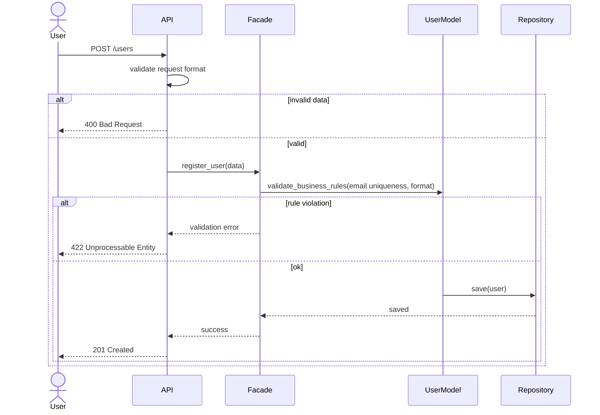
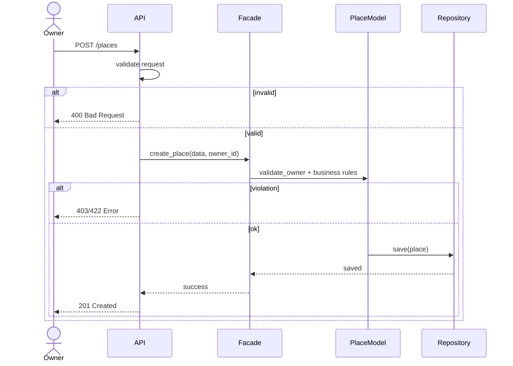
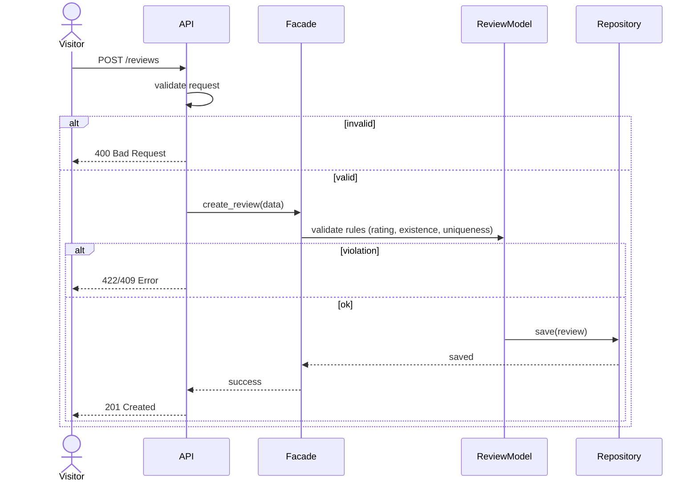
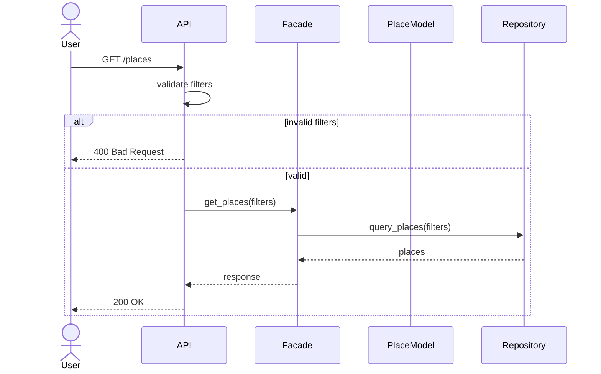

# Sequence Diagrams – HBnB Application

## Overview

This document presents sequence diagrams illustrating how the different layers of the HBnB application interact to handle key API calls.

The diagrams explicitly show:
- The separation between Presentation Layer (API), Business Logic Layer (Facade + Models), and Persistence Layer (Repository).
- Validation steps at different levels (request validation vs business rules validation).
- Explicit HTTP status codes returned depending on the outcome (200, 201, 400, 403, 409, 422).
- Alternative execution flows using `alt` blocks (success vs error paths).

These diagrams demonstrate both successful operations and error handling scenarios.

---

## User Registration

This sequence diagram illustrates the complete lifecycle of a user registration request (`POST /users`).

It highlights:
- Initial request format validation at the API level (syntactic validation).
- Business rule validation at the Facade/UserModel level (email uniqueness, format rules).
- Clear separation of responsibility between API and Business Logic.
- Explicit HTTP error handling:
  - **400 Bad Request** → invalid request structure.
  - **422 Unprocessable Entity** → business rule violation.
  - **201 Created** → successful user creation.
- Persistence through the Repository layer only after validation succeeds.

## Diagramme 1 : User Registration

---
## Place creation : owner

This diagram represents the creation of a place by an Owner (`POST /places`).

It emphasizes:
- Validation at the API layer (request structure).
- Authorization and ownership validation at the Business Logic level.
- Multiple possible error responses:
  - **400 Bad Request** → malformed input.
  - **403 Forbidden** → ownership or permission violation.
  - **422 Unprocessable Entity** → business rule violation.
  - **201 Created** → place successfully created.
- Data persistence only after all validations succeed.

---
## Diagramme 3 : Review Submission (Visitor)

This diagram illustrates how a Visitor submits a review (`POST /reviews`).

It highlights:
- Request validation at the API level.
- Business constraints validation (rating limits, place existence, uniqueness of review).
- Error differentiation:
  - **400 Bad Request** → invalid request format.
  - **422 Unprocessable Entity** → rule violation (e.g., invalid rating).
  - **409 Conflict** → duplicate or conflicting review.
  - **201 Created** → review successfully stored.
- Respect of layered architecture before persistence.

---
## Diagramm : Fetching a List of Places

This diagram shows how users retrieve data (`GET /places`).

It demonstrates:
- Query parameter validation at the API level.
- Data retrieval through the Facade and Repository layers.
- Handling of invalid filters with:
  - **400 Bad Request**
- Successful retrieval returning:
  - **200 OK**
- Clear distinction between read operations (GET) and write operations (POST).

---
## Conclusion

These sequence diagrams provide a clear and structured view of how the HBnB application handles key API calls.

They demonstrate:

* The separation of concerns between the Presentation Layer (API), Business Logic Layer (Facade + Models), and Persistence Layer (Repository).

* How validation and business rules are enforced at the appropriate layer.

* The handling of success and error scenarios with explicit HTTP status codes.

* The step-by-step flow of information for each API call, showing how data moves through the system from request to persistence.

By visualizing these interactions, the diagrams help ensure that the system architecture is clear, maintainable, and consistent with HBnB’s business rules and RESTful API design principles.
