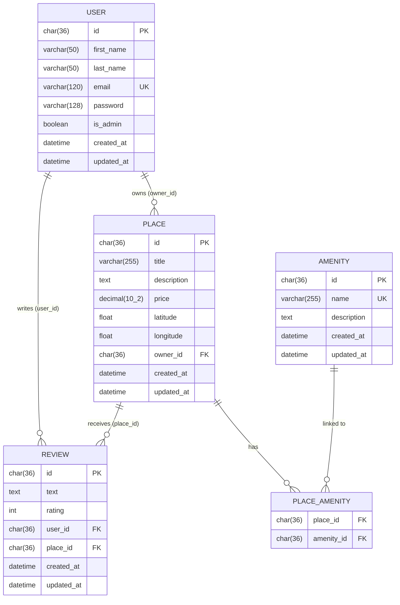
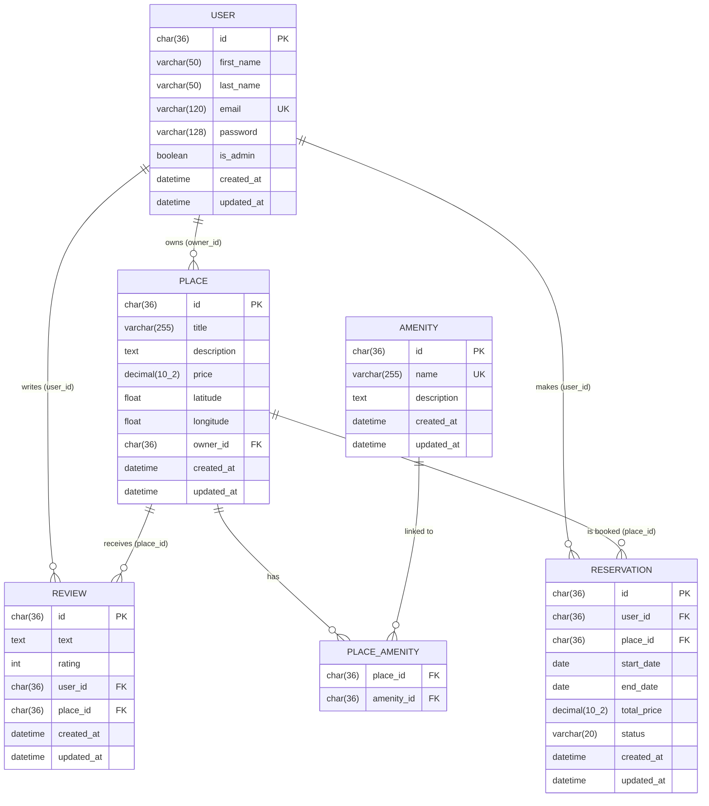

# HBnB — Part 3: Authentication & Database Persistence


## Overview

Part 3 of the HBnB project extends the in-memory application from Part 2 by adding:

- **JWT Authentication** — secure login with access tokens
- **RBAC** — role-based access control (admin vs regular user)
- **SQLite persistence** — full database storage via SQLAlchemy ORM
- **bcrypt password hashing** — secure storage of user passwords
- **SQL schema** — schema.sql + initial_data.sql for clean DB setup

---

## Architecture

```
┌─────────────────────────────────┐
│        API Layer (Flask-RESTx)  │  ← HTTP endpoints, Swagger UI
└────────────────┬────────────────┘
                 │
┌────────────────▼────────────────┐
│      Facade Layer (HBnBFacade)  │  ← business logic, validation
└────────────────┬────────────────┘
                 │
┌────────────────▼────────────────┐
│   Repository Layer (SQLAlchemy) │  ← CRUD operations, ORM queries
└────────────────┬────────────────┘
                 │
┌────────────────▼────────────────┐
│   Models Layer (db.Model)       │  ← User, Place, Review, Amenity
└────────────────┬────────────────┘
                 │
┌────────────────▼────────────────┐
│   SQLite Database               │  ← instance/development.db
└─────────────────────────────────┘
```

---

## Project Structure

```
hbnb/
├── run.py
├── config.py
├── requirements.txt
├── schema.sql                    ← table creation with constraints
├── initial_data.sql              ← admin user + 3 default amenities
├── app/
│   ├── __init__.py               ← factory: bcrypt, jwt, db, create_all
│   ├── api/
│   │   ├── __init__.py
│   │   └── v1/
│   │       ├── __init__.py       ← Swagger config + Authorize button
│   │       ├── auth.py           ← POST /auth/login
│   │       ├── users.py          ← CRUD users + RBAC
│   │       ├── places.py         ← CRUD places + ownership check
│   │       ├── reviews.py        ← CRUD reviews + ownership check
│   │       └── amenities.py      ← admin only POST/PUT
│   ├── models/
│   │   ├── base_model.py         ← db.Model: id, created_at, updated_at
│   │   ├── user.py               ← bcrypt + SQLAlchemy + validators
│   │   ├── place.py              ← SQLAlchemy + FK + validators
│   │   ├── review.py             ← SQLAlchemy + FK + validators
│   │   ├── amenity.py            ← SQLAlchemy + validators
│   │   └── sql_tables.py         ← place_amenity association table
│   ├── persistence/
│   │   ├── repository.py         ← SQLAlchemyRepository (generic CRUD)
│   │   └── repositories/
│   │       ├── user_repository.py      ← get_user_by_email()
│   │       ├── place_repository.py     ← get_places_by_owner()
│   │       ├── review_repository.py    ← get_reviews_by_place()
│   │       └── amenity_repository.py   ← get_amenity_by_name()
│   └── services/
│       └── facade.py             ← single entry point for business logic
├── instance/
│   └── development.db            ← SQLite (auto-created)
└── tests/
    ├── run_tests.py              ← 68 automated DB tests (Python/SQLite)
    ├── test_api.py               ← 59 automated HTTP API tests
    ├── test_crud.sql             ← direct SQL tests
    └── swagger_tests.md          ← manual Swagger test guide
```

---

## Database Entity-Relationship Diagram

### Main diagram — 5 tables



### Extended diagram — with Reservation entity (bonus Task 10)



> The `RESERVATION` entity is a future extension. `status` can be `pending`, `confirmed` or `cancelled`. `total_price` is computed from `start_date`, `end_date` and the place's price per night.

### Database Constraints

| Table | Constraint | Column |
|---|---|---|
| `users` | UNIQUE | `email` |
| `amenities` | UNIQUE | `name` |
| `reviews` | UNIQUE | `(user_id, place_id)` |
| `place_amenity` | PRIMARY KEY composite | `(place_id, amenity_id)` |
| `places` | CHECK | `price > 0` |
| `places` | CHECK | `latitude BETWEEN -90 AND 90` |
| `places` | CHECK | `longitude BETWEEN -180 AND 180` |
| `reviews` | CHECK | `rating BETWEEN 1 AND 5` |

### Foreign Key Strategy

| Relationship | ON DELETE | Reason |
|---|---|---|
| `users` → `places` | CASCADE | Deleting a user removes their places |
| `users` → `reviews` | CASCADE | Deleting a user removes their reviews |
| `places` → `reviews` | RESTRICT | Cannot delete a place with active reviews |
| `places` → `place_amenity` | CASCADE | Deleting a place clears amenity links |
| `amenities` → `place_amenity` | CASCADE | Deleting an amenity clears place links |

---

## Installation

```bash
# Clone the repository
git clone https://github.com/holbertonschool-hbnb
cd holbertonschool-hbnb/part3/hbnb

# Create and activate virtual environment
python3 -m venv venv
source venv/bin/activate

# Install dependencies
pip install -r requirements.txt
```

---

## Getting Started

### First launch

```bash
# Create and seed the database
sqlite3 instance/development.db < schema.sql
sqlite3 instance/development.db < initial_data.sql

# Start the server
python3 run.py
```

The server runs on `http://127.0.0.1:5000`
Swagger UI is available at `http://127.0.0.1:5000/api/v1/`

### Reset the database

```bash
rm -f instance/development.db
sqlite3 instance/development.db < schema.sql
sqlite3 instance/development.db < initial_data.sql
```

---

## Default Data

| Data | Value |
|---|---|
| Admin email | `admin@hbnb.io` |
| Admin password | `admin1234` |
| Admin ID | `36c9050e-ddd3-4c3b-9731-9f487208bbc1` |
| WiFi UUID | `7c9fdf4d-99be-4b1c-8c2e-5aea5db0d0eb` |
| Swimming Pool UUID | `ae5ae8a5-0203-451b-9cb8-6086e5b2f41e` |
| Air Conditioning UUID | `97bc1cc5-3dcd-439e-894f-e9986dedd012` |

---

## API Endpoints

### Authentication
| Method | Endpoint | Access | Description |
|---|---|---|---|
| POST | `/api/v1/auth/login` | Public | Login and get JWT token |

### Users
| Method | Endpoint | Access | Description |
|---|---|---|---|
| POST | `/api/v1/users/` | Admin only | Create a user |
| GET | `/api/v1/users/` | Public | List all users |
| GET | `/api/v1/users/<id>` | Public | Get user by ID |
| PUT | `/api/v1/users/<id>` | Own account / Admin | Update user |

### Amenities
| Method | Endpoint | Access | Description |
|---|---|---|---|
| POST | `/api/v1/amenities/` | Admin only | Create an amenity |
| GET | `/api/v1/amenities/` | Public | List all amenities |
| GET | `/api/v1/amenities/<id>` | Public | Get amenity by ID |
| PUT | `/api/v1/amenities/<id>` | Admin only | Update amenity |

### Places
| Method | Endpoint | Access | Description |
|---|---|---|---|
| POST | `/api/v1/places/` | Authenticated | Create a place |
| GET | `/api/v1/places/` | Public | List all places |
| GET | `/api/v1/places/<id>` | Public | Get place with owner + amenities |
| PUT | `/api/v1/places/<id>` | Owner / Admin | Update place |
| GET | `/api/v1/places/<id>/reviews` | Public | Get all reviews for a place |

### Reviews
| Method | Endpoint | Access | Description |
|---|---|---|---|
| POST | `/api/v1/reviews/` | Authenticated | Create a review |
| GET | `/api/v1/reviews/` | Public | List all reviews |
| GET | `/api/v1/reviews/<id>` | Public | Get review by ID |
| PUT | `/api/v1/reviews/<id>` | Author / Admin | Update review |
| DELETE | `/api/v1/reviews/<id>` | Author / Admin | Delete review |

---

## RBAC Access Rules

| Action | No token | Regular user | Admin |
|---|---|---|---|
| Create user | 401 | 403 | 201 |
| Update own profile | 401 | 200 | 200 |
| Update other's profile | 401 | 403 | 200 |
| Create amenity | 401 | 403 | 201 |
| Update amenity | 401 | 403 | 200 |
| Create place | 401 | 201 | 201 |
| Update own place | 401 | 200 | 200 |
| Update other's place | 401 | 403 | 200 |
| Create review | 401 | 201 | 201 |
| Review own place | 401 | 400 | 400 |
| Update own review | 401 | 200 | 200 |
| Update other's review | 401 | 403 | 200 |
| Delete own review | 401 | 200 | 200 |
| Delete other's review | 401 | 403 | 200 |

---

## API Usage Examples

### 1. Login and get a token

```bash
curl -X POST http://127.0.0.1:5000/api/v1/auth/login \
  -H "Content-Type: application/json" \
  -d '{"email": "admin@hbnb.io", "password": "admin1234"}'
```

**Response 200:**
```json
{
  "access_token": "eyJhbGciOiJIUzI1NiIsInR5cCI6IkpXVCJ9..."
}
```

---

### 2. Create a user (admin token required)

```bash
curl -X POST http://127.0.0.1:5000/api/v1/users/ \
  -H "Authorization: Bearer <token>" \
  -H "Content-Type: application/json" \
  -d '{
    "first_name": "John",
    "last_name": "Doe",
    "email": "john@test.com",
    "password": "password123"
  }'
```

**Response 201:**
```json
{
  "id": "a1b2c3d4-...",
  "first_name": "John",
  "last_name": "Doe",
  "email": "john@test.com"
}
```

**Response 403 (regular user):**
```json
{"error": "Admin privileges required"}
```

**Response 422 (duplicate email):**
```json
{"error": "Email already exists"}
```

---

### 3. Create a place

```bash
curl -X POST http://127.0.0.1:5000/api/v1/places/ \
  -H "Authorization: Bearer <token>" \
  -H "Content-Type: application/json" \
  -d '{
    "title": "Paris Apartment",
    "description": "Beautiful flat near the Eiffel Tower",
    "price": 120.00,
    "latitude": 48.8566,
    "longitude": 2.3522,
    "amenities": ["7c9fdf4d-99be-4b1c-8c2e-5aea5db0d0eb"]
  }'
```

**Response 201:**
```json
{
  "id": "72486b52-...",
  "title": "Paris Apartment",
  "price": 120.0,
  "latitude": 48.8566,
  "longitude": 2.3522,
  "owner_id": "<jwt_user_id>"
}
```

**Response 400 (invalid price):**
```json
{"error": "price must be greater than 0"}
```

---

### 4. Get place details — owner + amenities nested

```bash
curl -X GET http://127.0.0.1:5000/api/v1/places/72486b52-...
```

**Response 200:**
```json
{
  "id": "72486b52-...",
  "title": "Paris Apartment",
  "description": "Beautiful flat near the Eiffel Tower",
  "price": 120.0,
  "latitude": 48.8566,
  "longitude": 2.3522,
  "owner": {
    "id": "36c9050e-...",
    "first_name": "Admin",
    "last_name": "HBnB",
    "email": "admin@hbnb.io"
  },
  "amenities": [
    {"id": "7c9fdf4d-...", "name": "WiFi"}
  ]
}
```

---

### 5. Create a review

```bash
curl -X POST http://127.0.0.1:5000/api/v1/reviews/ \
  -H "Authorization: Bearer <token>" \
  -H "Content-Type: application/json" \
  -d '{
    "text": "Amazing place, highly recommend!",
    "rating": 5,
    "place_id": "72486b52-..."
  }'
```

**Response 201:**
```json
{
  "id": "cccc0001-...",
  "text": "Amazing place, highly recommend!",
  "rating": 5,
  "user_id": "<jwt_user_id>",
  "place_id": "72486b52-..."
}
```

**Response 400 (own place):**
```json
{"error": "You cannot review your own place"}
```

**Response 400 (duplicate):**
```json
{"error": "You have already reviewed this place"}
```

---

### 6. Common error responses

| Scenario | Code | Response |
|---|---|---|
| No token | 401 | `{"msg": "Missing Authorization Header"}` |
| Expired token | 401 | `{"msg": "Token has expired"}` |
| Not admin | 403 | `{"error": "Admin privileges required"}` |
| Not owner | 403 | `{"error": "Unauthorized action"}` |
| Not found | 404 | `{"error": "Place not found"}` |
| Duplicate email | 422 | `{"error": "Email already exists"}` |
| Invalid price | 400 | `{"error": "price must be greater than 0"}` |
| Invalid rating | 400 | `{"error": "Rating must be between 1 and 5"}` |

---

## Running the Tests

### Reset DB before each test run

```bash
rm -f instance/development.db
sqlite3 instance/development.db < schema.sql
sqlite3 instance/development.db < initial_data.sql
```

### DB Python tests — 68 tests

```bash
python3 tests/run_tests.py
```

Covers: initial data, CRUD for all entities, FK constraints, relations, RBAC, ordered deletion.

### API HTTP tests — 59 tests

```bash
# Terminal 1
python3 run.py

# Terminal 2
python3 tests/test_api.py
```

Covers: Auth (5), Users (10), Amenities (8), Places (9), Reviews (14), RBAC (8), Relations (5).

### Direct SQL tests

```bash
sqlite3 instance/development.db < tests/test_crud.sql
```

---

## Test Results

| Suite | Tests | Result |
|---|---|---|
| `test_api.py` — HTTP API | 59/59 | ✅ All passed |
| `run_tests.py` — DB Python | 65/68 | ✅ (3 expected FAIL) |
| `test_crud.sql` — SQL direct | sections 0→3, 6→7 | ✅ |

> The 3 failures in `run_tests.py` (tests 3.10, 5.5, 5.6) are **intentional**: the project uses `ON DELETE CASCADE` on user→places and user→reviews, per the team's architecture decision. The test script was written expecting `RESTRICT` — this mismatch is documented and accepted.

---

## Swagger UI

1. Start the server: `python3 run.py`
2. Open `http://127.0.0.1:5000/api/v1/`
3. Call **POST /auth/login** → copy the `access_token`
4. Click **Authorize** → type `Bearer <token>` → Authorize
5. All protected endpoints are now accessible

> If you get `401 Token has expired`, re-login and paste the new token in Authorize.

---

## Authors

- **Sara Rebati**
- **Valentin Planchon**
- **Damien Rossi**

Holberton School — 2026
