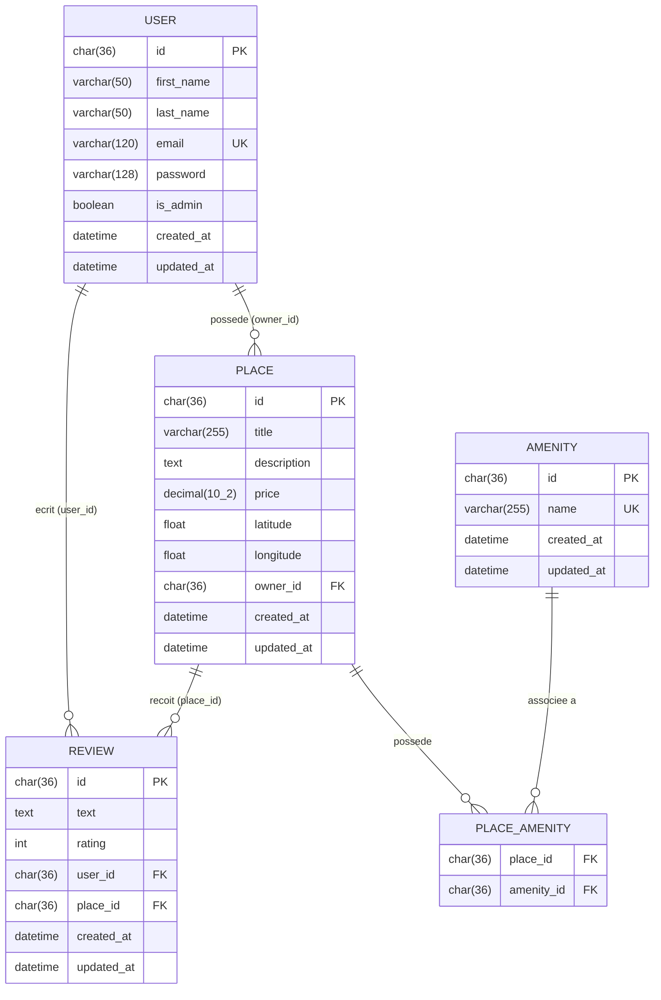
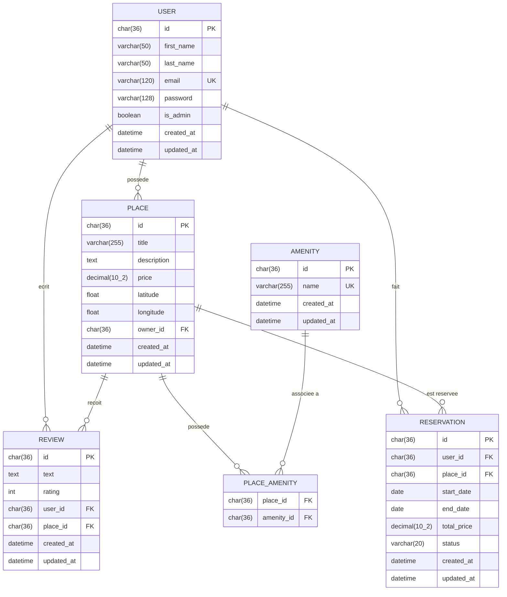

# HBnB — Diagramme Entité-Relation (ER)

Ce diagramme représente le schema complet de la base de données du projet HBnB,
généré avec Mermaid.js.

## Diagramme principal



---

## Description des relations

### User → Place (One-to-Many)
Un utilisateur peut posseder plusieurs logements.
Chaque logement appartient a un seul utilisateur (`owner_id`).

```
USER ||--o{ PLACE : "possede"
```

### User → Review (One-to-Many)
Un utilisateur peut ecrire plusieurs avis.
Chaque avis est ecrit par un seul utilisateur (`user_id`).

```
USER ||--o{ REVIEW : "ecrit"
```

### Place → Review (One-to-Many)
Un logement peut recevoir plusieurs avis.
Chaque avis concerne un seul logement (`place_id`).

```
PLACE ||--o{ REVIEW : "recoit"
```

### Place ↔ Amenity (Many-to-Many)
Un logement peut avoir plusieurs equipements.
Un equipement peut etre associe a plusieurs logements.
Cette relation est geree par la table de jonction `PLACE_AMENITY`.

```
PLACE ||--o{ PLACE_AMENITY : "possede"
AMENITY ||--o{ PLACE_AMENITY : "associee a"
```

---

## Contraintes importantes

| Table | Contrainte | Colonne |
|---|---|---|
| `users` | UNIQUE | `email` |
| `amenities` | UNIQUE | `name` |
| `reviews` | UNIQUE | `(user_id, place_id)` |
| `place_amenity` | PRIMARY KEY composite | `(place_id, amenity_id)` |
| `places` | CHECK | `price > 0` |
| `places` | CHECK | `latitude BETWEEN -90 AND 90` |
| `places` | CHECK | `longitude BETWEEN -180 AND 180` |
| `reviews` | CHECK | `rating BETWEEN 1 AND 5` |

---

## Diagramme etendu — avec Reservation (bonus)

La task demande d'imaginer une entite `Reservation` liee a `User` et `Place` :



### Pourquoi Reservation ?
- Un `User` peut faire plusieurs reservations → `user_id` FK vers `users`
- Une `Place` peut etre reservee plusieurs fois → `place_id` FK vers `places`
- `status` peut etre : `pending`, `confirmed`, `cancelled`
- `total_price` = calculee automatiquement selon les dates et le prix par nuit
